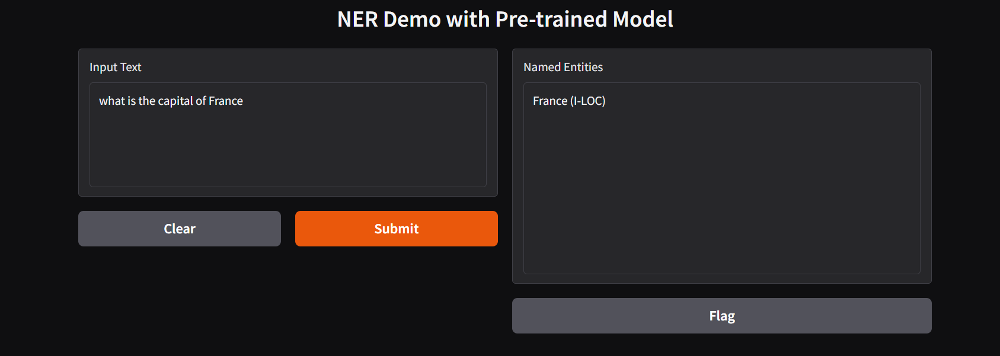

## Development of a Named Entity Recognition (NER) Prototype Using a Fine-Tuned BART Model and Gradio Framework

### AIM:
To design and develop a prototype application for Named Entity Recognition (NER) by leveraging a fine-tuned BART model and deploying the application using the Gradio framework for user interaction and evaluation.

### PROBLEM STATEMENT:
Named Entity Recognition (NER) is a fundamental task in Natural Language Processing (NLP) that involves identifying and classifying key entities like names, organizations, locations, and dates in a given text. The goal of this project is to create a user-friendly NER tool that integrates a fine-tuned BART model to demonstrate state-of-the-art capabilities in recognizing entities from textual data.

### DESIGN STEPS:

#### STEP 1: Data Collection and Preprocessing
Collect a labeled dataset for NER tasks. Common datasets include CoNLL-2003, OntoNotes, or a custom dataset. Download or create a dataset with entities labeled in BIO format (Begin, Inside, Outside). Preprocess the text data, tokenizing it for compatibility with BART. Split the data into training, validation, and testing sets.

#### STEP 2: Fine-Tuning the BART Model
Use the Hugging Face transformers library. Load a pre-trained BART model (facebook/bart-base or similar). Modify the model for token classification by adding a classification head. Train the model on the preprocessed dataset using a suitable optimizer and scheduler.

#### STEP 3: Model Evaluation
Use metrics like F1-score, precision, and recall for evaluation. Test the model on unseen data and analyze its performance on different entity types.

#### STEP 4: Application Development Using Gradio
Design the interface with Gradio to allow users to input text and view extracted entities. Integrate the fine-tuned BART model into the Gradio app. Define a backend function that processes user input through the model and displays the results.

#### STEP 5: Deployment and Testing
Host the application on a cloud platform like Hugging Face Spaces or Google Colab. Collect user feedback to improve usability and performance.

### PROGRAM:
```
from transformers import AutoTokenizer, AutoModelForTokenClassification
from transformers import pipeline
import gradio as gr

# Load pre-trained BERT NER model and tokenizer
model_name = "dbmdz/bert-large-cased-finetuned-conll03-english"
tokenizer = AutoTokenizer.from_pretrained(model_name)
model = AutoModelForTokenClassification.from_pretrained(model_name)

# Create a pipeline for NER
ner_pipeline = pipeline("ner", model=model, tokenizer=tokenizer)

# Function to process user input
def ner_function(text):
    entities = ner_pipeline(text)
    return "\n".join([f"{ent['word']} ({ent['entity']})" for ent in entities])

# Gradio Interface
iface = gr.Interface(
    fn=ner_function,
    inputs=gr.Textbox(lines=5, label="Input Text"),
    outputs=gr.Textbox(lines=10, label="Named Entities"),
    title="NER Demo with Pre-trained Model"
)

iface.launch()
```
### OUTPUT:


### RESULT:
Successfully a prototype application for Named Entity Recognition (NER) by leveraging a fine-tuned BART model and deploying the application using the Gradio framework for user interaction and evaluation.